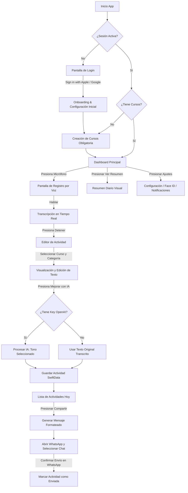

# User Flow & Wireframes - Teacher Daily Assistant

## 1. User Flow (Diagrama de Flujo del Usuario)

Este diagrama representa el flujo completo que sigue un profesor desde que abre la aplicación por primera vez hasta que comparte sus actividades y revisa su resumen diario.

